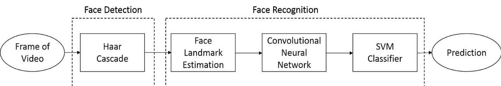

# ELEN6767-Large-Data-Steam-Processing

# Abstract

This project designs a real time face recognition streaming system for videos. The system includes a haar cascade classifier, face landmark estimation, convolutional neural network and a linear SVM classifier. The system is implemented in spark using python. To improve throughput, optimization methods including data parallelize and load shedding were applied. In the experiment section, the system accuracy was computed, the threshold for load shedding was selected, the throughput improvement by optimization was calculated and a real time webcam video application featuring the three group members was implemented. The system throughput after optimization is 14:54 frames per second, increasing the system throughput by 197:13%. Frames dropped is 40:2% of total frames. 

**Index Terms—Face Recognition, Video Streaming System**

# I. Introduction

Live video streaming has become a popular way of entertainment and processing streaming videos has become a rising research area. Compared with images, the demand on system through put is much stricter.

Therefore, the project objective is to design a real time face recognition streaming system for videos and do optimizations for improving throughput.

The project has three major innovations and challenges:

1. Implement a face recognition streaming system in spark
2. Applied optimization techniques to improve system throughput, including data parallelize and load shedding
3. Experimented system on video datasets and live webcam streaming videos

# II. System Overview
The following shows the workflow of single input image in the streaming face recognition system.

1. Collect an image frame from webcam video stream.
2. Detect faces with a pre-trained haar cascade model.
3. Apply face landmark estimation to get perfectly centered faces. The objective of face landmark estimation is locating 68 specific points, also called landmarks, that exist on every face, including  the top of the chin, the outside edge of each eye, the inner edge of each eyebrow, etc. Then use affine transformations to get as perfect as possible centered faces. This operator can increase the face recognition accuracy.
4. Extract face features from the image from embed a convolutional neural network.
5. Label the person name using a SVM classifier.
6. Show image with bounding boxes and name labels on computer.

  Fig. 1: Face Recognition Streaming System

## III. See Other Details in Report.pdf

